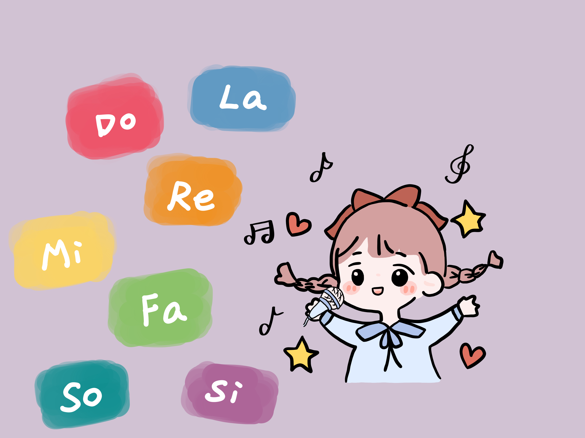

# PitchBlock

## Introduction

PitchBlock is a music game that uses sound to hit falling blocks. The main feature of PitchBlock is to let users experience and accurately sing the pitch in the way of games, so as to better sing songs and improve the sense of music. Pitch is a perceptual property of sounds that allows their ordering on a frequency-related scale. We usually use "Do Re Mi Fa So La Si" to represent seven pitches in sequence. In this game, you can speak freely to feel the pitch, or practice and sing according to the pitch indicated on the falling block. After a little practice, you will be able to sing the song Twinkle Twinkle Little Star smoothly.

